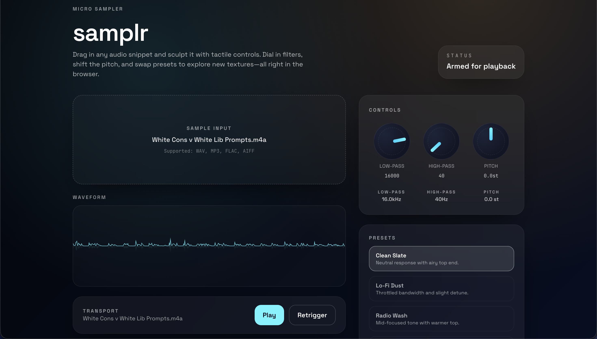

# samplr



## Overview

samplr is a compact, browser-native audio sampler inspired by Ableton Live’s Simpler device. Drag any audio clip into the stage, visualize its waveform instantly, and sculpt the tone with tactile low-pass, high-pass, and pitch controls. Curated presets offer one-click vibes ranging from clean and airy to detuned lo-fi.

## Highlights

- Drag-and-drop sample intake with visual feedback and file-picker fallback
- Real-time waveform renderer driven by Web Audio buffers
- Custom knob UI for low-pass, high-pass, and pitch adjustments with smooth ramps
- Preset browser for instant tonal shifts (clean, lo-fi, radio wash, sub shift)
- UnoCSS-styled interface that mimics boutique desktop samplers

## Stack

- React 19 + Vite 7 + TypeScript
- Web Audio API for decoding, filtering, and playback-rate control
- UnoCSS with custom theme tokens and typography (Space Grotesk + JetBrains Mono)

## Getting Started

1. Install dependencies
   ```bash
   npm install
   ```
2. Launch the dev server
   ```bash
   npm run dev
   ```
3. Build for production
   ```bash
   npm run build
   ```

Drop a WAV/MP3/AIFF/FLAC file onto the sampler surface (or click the pad) to start sculpting. Update `public/sampler-preview.svg` with a fresh screenshot whenever you iterate on the UI.
