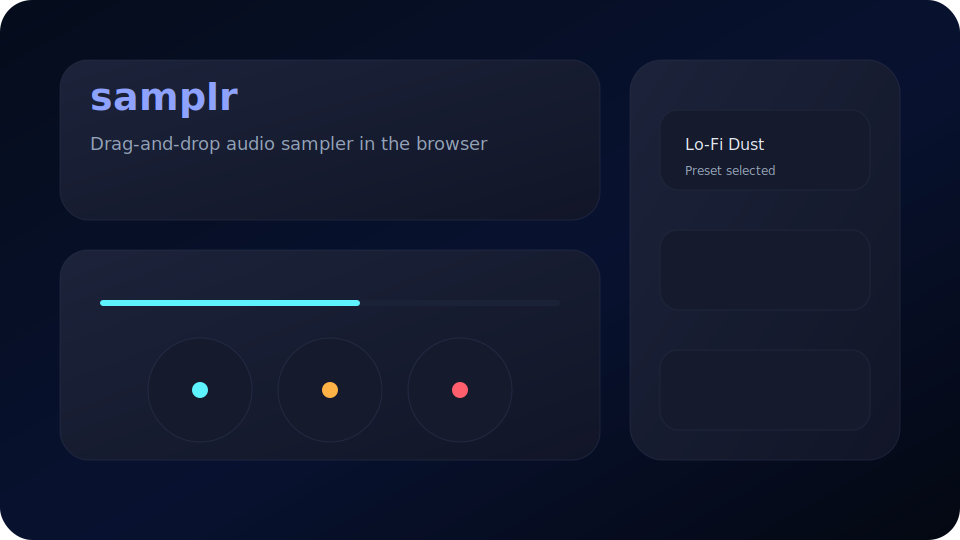

# React + TypeScript + Vite

This template provides a minimal setup to get React working in Vite with HMR and some ESLint rules.

Currently, two official plugins are available:

- [@vitejs/plugin-react](https://github.com/vitejs/vite-plugin-react/blob/main/packages/plugin-react) uses [Babel](https://babeljs.io/) (or [oxc](https://oxc.rs) when used in [rolldown-vite](https://vite.dev/guide/rolldown)) for Fast Refresh
- [@vitejs/plugin-react-swc](https://github.com/vitejs/vite-plugin-react/blob/main/packages/plugin-react-swc) uses [SWC](https://swc.rs/) for Fast Refresh

## React Compiler

## Expanding the ESLint configuration

## samplr

> A tactile browser-based audio sampler inspired by compact hardware units. Drag a clip into the pad, visualize the waveform, dial in filter and pitch changes, and jump between curated presets without leaving the tab.



## Features

- Drag-and-drop (or click-to-load) audio intake with decoding feedback
- Real-time waveform rendering powered by the Web Audio API
- Dedicated low-pass, high-pass, and pitch controls with custom knob UI
- Preset browser for one-tap tonal shifts (clean, lo-fi, radio, sub-heavy)
- Glassy DAW-inspired interface styled with UnoCSS shortcuts

## Tech Stack

- React 19 + Vite 7 (TypeScript)
- Web Audio API for playback, filters, and pitch shifting
- UnoCSS for utility-first styling + custom themes

## Getting Started

1. Install dependencies:

```bash
npm install
```

2. Start the dev server:

```bash
npm run dev
```

3. Build for production:

```bash
npm run build
```

Drop an audio file (wav, mp3, aiff, flac) into the sampler surface to begin sculpting. Replace `public/sampler-preview.svg` with an updated screenshot whenever the UI evolves.

```js
export default defineConfig([
  globalIgnores(["dist"]),
  {
    files: ["**/*.{ts,tsx}"],
    extends: [
      // Other configs...

      // Remove tseslint.configs.recommended and replace with this
      tseslint.configs.recommendedTypeChecked,
      // Alternatively, use this for stricter rules
      tseslint.configs.strictTypeChecked,
      // Optionally, add this for stylistic rules
      tseslint.configs.stylisticTypeChecked,

      // Other configs...
    ],
    languageOptions: {
      parserOptions: {
        project: ["./tsconfig.node.json", "./tsconfig.app.json"],
        tsconfigRootDir: import.meta.dirname,
      },
      // other options...
    },
  },
]);
```

You can also install [eslint-plugin-react-x](https://github.com/Rel1cx/eslint-react/tree/main/packages/plugins/eslint-plugin-react-x) and [eslint-plugin-react-dom](https://github.com/Rel1cx/eslint-react/tree/main/packages/plugins/eslint-plugin-react-dom) for React-specific lint rules:

```js
// eslint.config.js
import reactX from "eslint-plugin-react-x";
import reactDom from "eslint-plugin-react-dom";

export default defineConfig([
  globalIgnores(["dist"]),
  {
    files: ["**/*.{ts,tsx}"],
    extends: [
      // Other configs...
      // Enable lint rules for React
      reactX.configs["recommended-typescript"],
      // Enable lint rules for React DOM
      reactDom.configs.recommended,
    ],
    languageOptions: {
      parserOptions: {
        project: ["./tsconfig.node.json", "./tsconfig.app.json"],
        tsconfigRootDir: import.meta.dirname,
      },
      // other options...
    },
  },
]);
```
